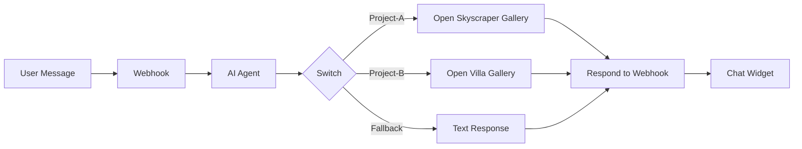

# 🏢 Blade Properties Chat Assistant

An **AI-powered chatbot widget** that intelligently identifies real estate projects from natural language and opens project galleries based on user queries. Built with **n8n workflow automation** and **Google Gemini AI**.

---

## 🎯 Overview

This project provides a conversational AI assistant for "Blade Properties" that can:

- **Understand natural language** – Users can ask about properties in plain English/Arabic
- **Identify projects** – AI determines which project the user is asking about
- **Take action** – Automatically opens project galleries in various display modes

### Demo Available Projects

| Project Name | Code | Description |
|--------------|------|-------------|
| The Downtown Skyscraper | `Project-A` | A flagship skyscraper development |
| The Seaside Villa | `Project-B` | A coastal luxury villa project |

---

## 🏗️ Architecture



### Components

1. **Frontend Chat Widget** – HTML/CSS/JavaScript chat interface
2. **n8n Workflow Backend** – Processes messages and routes responses
3. **Google Gemini AI** – Natural language understanding for project identification
4. **Project Gallery Pages** – Static HTML pages with project content

---

## 📁 Project Structure

```
CHAT OPEN WINDOW/
├── index-newtab.html      # Chat widget (opens projects in new tab)
├── index-newwindow.html   # Chat widget (opens projects in popup window)
├── separated.html         # Chat widget (opens projects in modal/iframe)
├── project-a.html         # Project gallery for "The Downtown Skyscraper"
├── n8n-workflow.json      # n8n workflow export (backend logic)
└── README.md              # This documentation
```

---

## 🚀 Features

### 💬 Chat Widget Variants

| File | Display Mode | Best For |
|------|--------------|----------|
| `index-newtab.html` | Opens in new browser tab | Desktop browsing |
| `index-newwindow.html` | Opens in popup window (900x700) | Focused viewing |
| `separated.html` | Opens in overlay modal/iframe | Single-page experience |

### 🤖 AI Capabilities

- **Project Identification** – Recognizes project names, aliases, and context
- **Intent Classification** – Distinguishes between project requests and general chat
- **Action/Text Response** – Returns structured JSON for frontend handling

### 📤 Response Types

```json
// Action Response (opens a page)
{
  "type": "action",
  "content": "https://example.com/project-gallery"
}

// Text Response (displays message)
{
  "type": "text",
  "content": "Sorry, I couldn't identify which project you meant."
}
```

---

## ⚙️ n8n Workflow

### Workflow Nodes

1. **Webhook** – Receives POST requests with user messages
2. **AI Agent** – Uses Gemini AI to classify the message
3. **Google Gemini Chat Model** – LLM for natural language processing
4. **Switch** – Routes based on AI output (`Project-A`, `Project-B`, or fallback)
5. **Edit Fields** – Constructs the response payload
6. **Respond to Webhook** – Returns JSON to the frontend

### Webhook Endpoint

```
POST https://n8n.ai-eg.online/webhook/49ef809d-d316-4068-ba46-a254084128ce
```

### Request Body

```json
{
  "message": "Show me the skyscraper project"
}
```

---

## 🛠️ Setup & Installation

### Prerequisites

- [n8n](https://n8n.io/) instance (self-hosted or cloud)
- Google Gemini API credentials
- Web server for hosting HTML files

### Step 1: Import n8n Workflow

1. Open your n8n instance
2. Go to **Workflows** → **Import from File**
3. Upload `n8n-workflow.json`
4. Configure the **Google Gemini Chat Model** node with your API key
5. Update webhook URLs if using a different n8n instance

### Step 2: Update Frontend Configuration

In each HTML file, update the webhook URL:

```javascript
const webhookUrl = 'https://YOUR-N8N-INSTANCE/webhook/YOUR-WEBHOOK-ID';
```

### Step 3: Deploy the Frontend

Host the HTML files on any web server:

- **Local development**: Open files directly in browser or use `python -m http.server`
- **Production**: Deploy to any static hosting (Netlify, Vercel, GitHub Pages, etc.)

### Step 4: Add Project Gallery URLs

In the n8n workflow "Edit Fields" nodes, update the URLs:

```javascript
// Edit Fields2 (Project-A)
"content": "https://your-domain.com/project-a.html"

// Edit Fields3 (Project-B)
"content": "https://your-domain.com/project-b.html"
```

---

## 💡 Customization

### Adding New Projects

1. **Update AI Agent System Message** (in n8n):
   ```
   The available projects are:
   - "The Downtown Skyscraper" which has the code 'Project-A'.
   - "The Seaside Villa" which has the code 'Project-B'.
   - "The Mountain Resort" which has the code 'Project-C'.  ← ADD NEW
   ```

2. **Add Switch Condition** – Add a new branch for `Project-C`

3. **Create Edit Fields Node** – Configure the URL for the new project

4. **Create Gallery Page** – Add `project-c.html` with the project content

### Styling the Chat Widget

All styling is contained within each HTML file's `<style>` block. Key classes:

| Class | Purpose |
|-------|---------|
| `.chat-widget` | Main container (width, height, shadow) |
| `.chat-header` | Header bar (background color, title) |
| `.user-message` | User message bubbles (background, alignment) |
| `.bot-message` | Bot message bubbles (background, alignment) |

---

## 🔧 API Reference

### Webhook Request

| Field | Type | Description |
|-------|------|-------------|
| `message` | string | User's chat message |

### Webhook Response

| Field | Type | Values | Description |
|-------|------|--------|-------------|
| `type` | string | `action`, `text` | Response type |
| `content` | string | URL or message | Payload content |

---

## 📋 Example Interactions

| User Says | AI Detects | Result |
|-----------|------------|--------|
| "Show me the skyscraper" | Project-A | Opens skyscraper gallery |
| "I want to see the villa" | Project-B | Opens villa gallery |
| "Tell me about downtown tower" | Project-A | Opens skyscraper gallery |
| "Hello, how are you?" | N/A | Text response: "sorry" |
| "What projects do you have?" | N/A | Text response: "sorry" |

---

## 🔒 Security Considerations

- Webhook is publicly accessible – consider adding authentication
- CORS must be configured on n8n (already handled via `origin: null`)
- Sensitive project URLs should be protected if needed

---

## 📜 License

This project is provided as-is for demonstration purposes.

---

## 🤝 Contributing

1. Fork the repository
2. Create a feature branch
3. Submit a pull request

---

## 📞 Support

For questions or issues, please open an issue in the repository or contact the development team.

---

**Built with ❤️ using n8n + Google Gemini AI**
